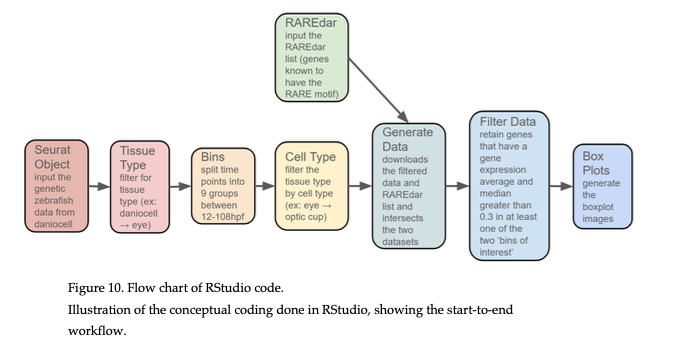

# Gene Expression Patterning in Zebrafish Development

This code was written by Ayah Sibai as part of a Reed College undergraduate thesis in 2024-25: _The Stripes of Optic Morphogenesis: Gene Expression Patterning in Zebrafish Development_. A flowchart of the data processing steps from the thesis is shown below:

The code identifies genes expressed in a certain tissue in the eye that are also predicted targets of RA signaling through presence of a RARE motif in the upstream sequence. 

## Daniocell

[Daniocell](https://daniocell.nichd.nih.gov/) is an online resource of single-cell gene expression data across 62 stages of zebrafish development (for more information read the Farrell Lab's [paper](https://pubmed.ncbi.nlm.nih.gov/37995681/)).

This code requires the processed Seurat (v4) object, a cluster annotations file, and builds upon their R script to load object and annotations. All data is available on the Daniocell main page.

## RAREdar

[RAREdar](https://github.com/susanxu3/RAREdar) is a Python script to identify retinoic acid receptor element (RARE) motifs from a Fasta file of promoter sequences. The most recent version is in a [Pull Request](https://github.com/susanxu3/RAREdar/pull/1); an older version of the repo is provided [here](https://github.com/Frankz55/RAREdar). We are planning to transfer this repo to `Reed-CompBio` and clean it up.

## `RARE-target-patterns.R`

This file was written by Ayah Sibai and based on a script from Kara Cerveny. The script is modeled after the Daniocell R script provided on their website. Note that there are hard-coded filenames; this will be cleaned up in future code refactoring.

The file identifies a cluster of cells within the eye and visualizes the expression of genes that are expressed in at least one (binned) time point during development.

## Questions

Please contact Anna Ritz (`annaritz`) or open a GitHub Issue with any questions.

